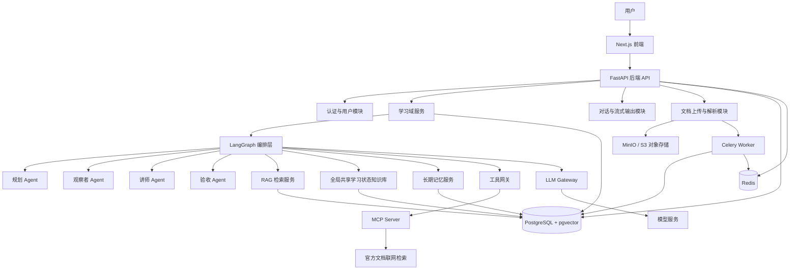
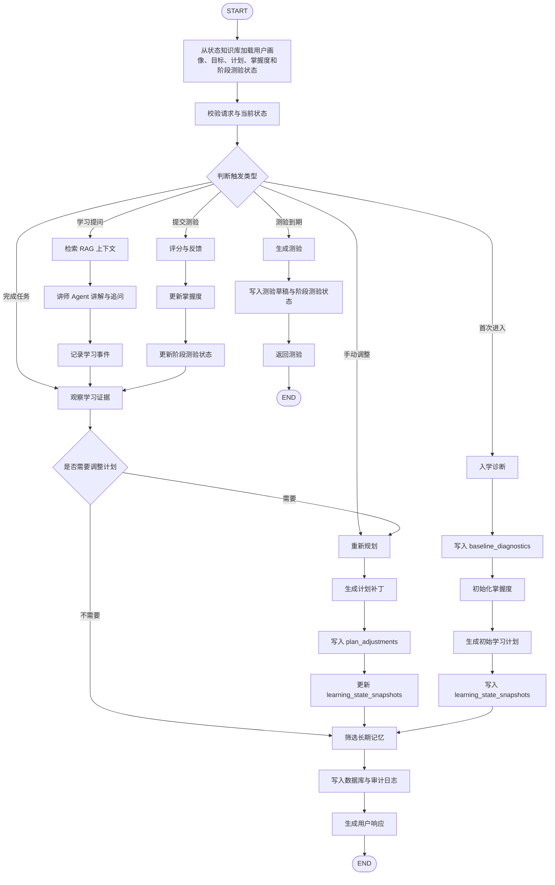

# 自适应私人讲师系统 V1：需求冻结与架构设计

> **定位**：面向 AI 应用开发学习的长期自适应私人讲师系统。  
> 系统根据用户基础、目标、可投入时间、学习行为和验收结果，生成并持续调整学习路径。

---

## 1. 产品边界

### 1.1 V1 产品定义

V1 聚焦于 **AI 应用开发学习**，不做所有学科通用导师。

核心目标：

```text
诊断起点
    ↓
生成学习路径
    ↓
每日学习与讲解
    ↓
采集学习证据
    ↓
周期验收
    ↓
更新掌握度
    ↓
动态调整计划
```

系统核心不是普通聊天，而是：

> 将每次学习行为转化为可用于调整学习计划的结构化证据。

---

## 2. V1 必须做 / 明确不做

### 2.1 必须做

| 模块 | V1 功能 |
|---|---|
| 用户诊断 | 收集目标、基础、时间预算、学习偏好，并完成诊断题 |
| 课程体系 | 内置 AI 应用开发知识图谱 |
| 学习计划 | 生成阶段目标、周目标和未来 14 天任务 |
| 今日学习 | 展示今日任务、资料、讲解、练习和学习证据提交 |
| 讲师 Agent | 概念解释、代码示例、追问、引用知识库资料 |
| 验收 Agent | 日测、周测、简单项目验收 |
| 观察者 Agent | 基于完成率、正确率、耗时、错误类型调整计划 |
| 规划 Agent | 首次生成计划、重排任务、补弱与进阶 |
| RAG | 内置资料库，以及用户上传的 PDF、图片、Markdown |
| 全局共享学习状态知识库 | 保存当前个性化起点、目标、计划、掌握度、阶段测验和最近调整状态 |
| 长期记忆 | 保存偏好、稳定基础、掌握度、长期目标、关键学习事件 |
| MCP | 一个只读联网工具：官方文档/可信来源检索 |
| 前端 | 入学诊断、学习主页、讲师页、测验页、进度页 |
| 可解释性 | 每次计划调整展示原因、触发条件和依据 |

### 2.2 明确不做

| 不做项 | 原因 |
|---|---|
| 同时覆盖考研、技术、语言等多个领域 | 课程结构、知识图谱与验收方式差异过大 |
| 音频陪练、视频分析、实时语音 | 模型链路和工程复杂度明显膨胀 |
| 手写公式高精度识别 | 第一版无法稳定验收 |
| 自动运行用户任意代码 | 涉及代码沙箱、安全隔离和资源控制 |
| 社交、排行榜、多人协作 | 与核心学习闭环无关 |
| 支付、会员、复杂权限体系 | 不影响第一阶段项目价值 |
| 自动爬取全网资料 | 容易引入过期、低质量和提示注入内容 |
| 多 Agent 自由讨论 | 难以控制、调试和解释 |

---

## 3. V1 课程范围

V1 内置一条 AI 应用开发学习路径：

```text
Python 工程基础
    ↓
FastAPI 服务开发
    ↓
LLM API 调用与 Prompt Engineering
    ↓
LangChain 工具调用
    ↓
RAG 知识库
    ↓
LangGraph 工作流
    ↓
Agent 长期记忆
    ↓
项目设计、部署与验收
```

每个知识点至少包含：

```text
知识点名称
前置依赖
学习目标
推荐资料
练习类型
验收方式
掌握阈值
预计学习时长
```

---

## 4. 核心业务闭环

```text
入学诊断
    ↓
初始化掌握度画像
    ↓
生成学习路径
    ↓
每日任务执行
    ↓
讲师讲解 + 练习
    ↓
提交学习证据
    ↓
日测 / 周测
    ↓
更新掌握度
    ↓
观察者判断是否偏离计划
    ↓
重排、补弱、降载或进阶
    ↓
进入下一轮学习
```

---

## 5. 总体系统架构图



---

## 6. 技术栈冻结

| 层级 | 技术选择 |
|---|---|
| 前端 | Next.js + TypeScript + Tailwind CSS |
| 后端 | FastAPI |
| Agent 编排 | LangGraph |
| 数据库 | PostgreSQL |
| 向量检索 | pgvector |
| 缓存与任务队列 | Redis |
| 异步任务 | Celery |
| 文件存储 | V1 默认 MinIO，保留 S3 兼容接口 |
| 文档解析 | V1 默认 PyMuPDF + Markdown parser；Unstructured 作为后续增强 |
| 图片处理 | V1 支持 OCR 文本提取和代码/文字截图读取，不承诺复杂视觉理解 |
| 模型接入 | 统一 LLM Gateway，支持 OpenAI-compatible API |
| 联网能力 | MCP Server，仅提供只读搜索工具 |
| 状态知识库 | PostgreSQL 结构化状态层，供所有 Agent 读取当前学习状态 |
| 部署 | Docker Compose |

> V1 使用 **模块化单体**，不拆微服务。

---

## 7. 全局共享学习状态知识库

全局共享学习状态知识库是 PostgreSQL 上的结构化状态层，用来承载“当前用户学习状态”，不是 RAG 向量资料库，也不保存未审核的网页内容。

它解决的问题是：

```text
入学诊断形成的个性化起点
当前学习目标与计划版本
当前掌握度快照
阶段性测验状态
最近一次计划调整及其原因
```

所有 Agent 读取当前状态时，统一通过 `load_context` 节点加载状态知识库。Agent 不直接写表；写入只能通过学习域服务或 LangGraph 的 `persist` 节点完成。

状态知识库与 RAG 的边界：

| 存储层 | 保存内容 | 不保存 |
|---|---|---|
| 全局共享学习状态知识库 | 个性化起点、当前目标、计划版本、掌握度快照、阶段测验状态、计划调整摘要 | 原始课程资料、网页正文、大段用户聊天记录 |
| RAG 资料库 | 内置课程资料、用户上传 PDF / Markdown / OCR 文本、可引用文档片段 | 当前状态、计划决策、长期记忆 |
| 长期记忆 | 经审核的稳定偏好、长期目标、关键学习事件 | 全量学习流水、未验证的外部网页内容 |

状态隔离规则：

```text
1. 当前状态必须按 user_id + goal_id 隔离。
2. Agent 只读取状态快照，不直接修改状态表。
3. RAG 检索结果不得直接写入状态知识库或长期记忆。
4. 外部资料只有经过结构化判断、来源记录和业务审计后，才能影响计划或记忆。
5. 状态快照可以被重建，事实来源仍以诊断、测验、任务、掌握度和计划调整记录为准。
```

---

## 8. 模块边界

| 模块 | 职责 | 不负责 |
|---|---|---|
| 前端 | 展示学习路径、任务、测验、图表、调整原因 | 不计算掌握度，不直接调用模型 |
| API 层 | 鉴权、接口、参数校验、流式响应 | 不写 Agent 决策逻辑 |
| 学习域服务 | 计划、任务、学习记录、进度、掌握度 | 不生成自然语言讲解 |
| LangGraph 编排层 | 调度 Agent、控制状态流转 | 不直接访问数据库表 |
| 全局共享学习状态知识库 | 聚合当前学习状态，供 Agent 统一读取 | 不保存 RAG 原文，不替代事实表 |
| 规划 Agent | 生成路径、调整任务顺序与负载 | 不直接判定用户掌握度 |
| 观察者 Agent | 根据学习证据判断是否偏离计划 | 不直接讲课 |
| 讲师 Agent | 讲解、举例、追问、生成练习 | 不直接修改长期记忆 |
| 验收 Agent | 出题、评分、生成反馈 | 不直接调整总计划 |
| RAG 服务 | 文档解析、切分、检索、引用 | 不判断用户能力 |
| 长期记忆服务 | 提取、审核、写入、读取稳定记忆 | 不保存全部聊天记录 |
| MCP 工具网关 | 联网检索、来源过滤、调用审计 | 不允许直接写用户数据 |
| 异步任务 | 文档解析、向量化、批量生成测验 | 不承担核心实时对话 |

---

## 9. Agent 责任边界

### 9.1 规划 Agent

**输入：**

```text
用户目标
截止日期
每周可用时间
知识图谱
当前掌握度
当前任务完成情况
历史计划调整记录
```

**输出：**

```json
{
  "plan_version": 3,
  "phase_goal": "完成 RAG 基础与一个知识库 Demo",
  "weekly_goal": "完成文档切分、向量化、检索评估",
  "daily_tasks": [],
  "prerequisite_checks": [],
  "risks": [],
  "rationale": []
}
```

### 9.2 观察者 Agent

观察者只根据结构化学习证据判断：

```text
任务完成率
学习耗时
题目正确率
重复错误次数
知识点掌握度变化
连续中断天数
用户自评置信度
```

**调整规则示例：**

| 条件 | 系统动作 |
|---|---|
| 7 天任务完成率 < 60% | 降低未来任务量 20% |
| 同一知识点连续两次正确率 < 60% | 插入前置知识补救任务 |
| 周测正确率 > 85%，且完成速度正常 | 解锁后续知识点 |
| 连续 3 天未学习 | 暂停堆积任务，生成恢复计划 |
| 某知识点掌握度下降明显 | 加入复习队列 |
| 用户时间预算减少 | 重新计算截止风险与学习节奏 |

### 9.3 讲师 Agent

**职责：**

```text
解释概念
提供生活化心智模型
给出代码示例
通过追问验证理解
基于 RAG 引用资料
生成当前任务关联的小练习
```

**限制：**

```text
不能直接修改学习计划
不能直接修改掌握度
不能直接写长期记忆
不能脱离知识图谱随意扩展课程
```

### 9.4 验收 Agent

**V1 验收层级：**

| 周期 | 验收形式 |
|---|---|
| 每日 | 3～5 道小题、概念解释、代码阅读题 |
| 每周 | 10～15 道综合题 + 小任务 |
| 阶段结束 | Mini Project + 项目复盘 |
| 每月 | 学习报告，不做复杂考试系统 |

**评分原则：**

```text
客观题：规则评分
代码阅读题：标准答案 + LLM 解释评分
概念解释题：评分 Rubric + LLM 评分
项目任务：Checklist + 用户提交说明
```

> V1 不运行用户任意代码。

---

## 10. 数据库表设计

### 10.1 用户与画像

#### `users`

| 字段 | 类型 | 说明 |
|---|---|---|
| id | UUID PK | 用户 ID |
| email | VARCHAR UNIQUE | 登录邮箱 |
| password_hash | VARCHAR | 密码哈希 |
| display_name | VARCHAR | 显示名称 |
| status | VARCHAR | active / disabled |
| created_at | TIMESTAMPTZ | 创建时间 |

#### `learner_profiles`

| 字段 | 类型 | 说明 |
|---|---|---|
| user_id | UUID PK FK | 用户 ID |
| weekly_hours | INT | 每周可投入时间 |
| available_slots | JSONB | 可学习时间段 |
| learning_preferences | JSONB | 偏好，如先讲原理再代码 |
| baseline_notes | TEXT | 初始能力描述 |
| privacy_settings | JSONB | 隐私设置 |
| updated_at | TIMESTAMPTZ | 更新时间 |

### 10.2 学习目标与课程图谱

#### `learning_goals`

| 字段 | 类型 | 说明 |
|---|---|---|
| id | UUID PK | 目标 ID |
| user_id | UUID FK | 所属用户 |
| title | VARCHAR | 学习目标名称 |
| domain | VARCHAR | ai_app_dev |
| target_outcome | TEXT | 最终可交付成果 |
| deadline | DATE | 截止日期 |
| weekly_hours_target | INT | 每周目标时长 |
| status | VARCHAR | active / paused / completed |
| created_at | TIMESTAMPTZ | 创建时间 |

#### `curricula`

| 字段 | 类型 | 说明 |
|---|---|---|
| id | UUID PK | 课程体系 ID |
| code | VARCHAR UNIQUE | 如 ai-app-dev-v1 |
| version | VARCHAR | 课程版本 |
| title | VARCHAR | 课程名称 |
| domain | VARCHAR | 所属领域 |
| is_active | BOOLEAN | 是否启用 |

#### `knowledge_nodes`

| 字段 | 类型 | 说明 |
|---|---|---|
| id | UUID PK | 知识点 ID |
| curriculum_id | UUID FK | 所属课程 |
| code | VARCHAR | 唯一编码 |
| title | VARCHAR | 知识点名称 |
| node_type | VARCHAR | concept / skill / project |
| difficulty | SMALLINT | 1～5 |
| estimated_minutes | INT | 预计学习时间 |
| mastery_threshold | NUMERIC | 达标阈值 |
| metadata | JSONB | 资料、标签、说明 |

#### `knowledge_edges`

| 字段 | 类型 | 说明 |
|---|---|---|
| id | UUID PK | 关系 ID |
| curriculum_id | UUID FK | 所属课程 |
| from_node_id | UUID FK | 前置节点 |
| to_node_id | UUID FK | 后续节点 |
| relation_type | VARCHAR | prerequisite / related |

### 10.3 学习计划与任务

#### `learning_plans`

| 字段 | 类型 | 说明 |
|---|---|---|
| id | UUID PK | 计划 ID |
| user_id | UUID FK | 用户 |
| goal_id | UUID FK | 学习目标 |
| curriculum_id | UUID FK | 课程 |
| version | INT | 计划版本 |
| status | VARCHAR | active / archived |
| generated_by | VARCHAR | planner / manual |
| rationale_json | JSONB | 计划依据 |
| valid_from | DATE | 生效日期 |
| valid_to | DATE | 计划覆盖范围 |
| created_at | TIMESTAMPTZ | 创建时间 |

#### `plan_tasks`

| 字段 | 类型 | 说明 |
|---|---|---|
| id | UUID PK | 任务 ID |
| plan_id | UUID FK | 所属计划 |
| user_id | UUID FK | 所属用户 |
| knowledge_node_id | UUID FK | 对应知识点 |
| task_type | VARCHAR | learn / practice / review / assessment |
| title | VARCHAR | 任务标题 |
| objective | TEXT | 可验证目标 |
| scheduled_date | DATE | 计划日期 |
| estimated_minutes | INT | 预计时长 |
| priority | SMALLINT | 优先级 |
| status | VARCHAR | pending / done / skipped / overdue |
| payload | JSONB | 任务详情 |
| origin | VARCHAR | planner / observer / manual |

### 10.4 全局共享学习状态知识库

#### `learning_state_snapshots`

| 字段 | 类型 | 说明 |
|---|---|---|
| id | UUID PK | 状态快照 ID |
| user_id | UUID FK | 用户 |
| goal_id | UUID FK | 当前学习目标 |
| active_plan_id | UUID FK | 当前生效计划 |
| active_plan_version | INT | 当前计划版本 |
| baseline_diagnostic_id | UUID FK nullable | 当前个性化起点 |
| phase_assessment_state_id | UUID FK nullable | 当前阶段测验状态 |
| latest_plan_adjustment_id | UUID FK nullable | 最近一次计划调整 |
| mastery_summary | JSONB | 当前掌握度聚合快照 |
| current_state | JSONB | 今日任务、复习队列、风险、下一步动作 |
| generated_from | JSONB | 快照来源表与记录 ID |
| updated_at | TIMESTAMPTZ | 更新时间 |

唯一索引：

```sql
UNIQUE(user_id, goal_id)
```

#### `baseline_diagnostics`

| 字段 | 类型 | 说明 |
|---|---|---|
| id | UUID PK | 起点诊断 ID |
| user_id | UUID FK | 用户 |
| goal_id | UUID FK | 学习目标 |
| submitted_answers | JSONB | 入学诊断答题与自评 |
| baseline_summary | TEXT | 初始化能力画像 |
| entry_node_id | UUID FK nullable | 推荐学习入口知识点 |
| knowledge_gaps | JSONB | 需要补齐的知识缺口 |
| initial_mastery | JSONB | 初始掌握度估计 |
| evidence_json | JSONB | 诊断依据与评分说明 |
| created_at | TIMESTAMPTZ | 创建时间 |

#### `phase_assessment_states`

| 字段 | 类型 | 说明 |
|---|---|---|
| id | UUID PK | 阶段测验状态 ID |
| user_id | UUID FK | 用户 |
| goal_id | UUID FK | 学习目标 |
| assessment_id | UUID FK nullable | 对应测验 |
| phase_code | VARCHAR | 阶段编码 |
| covered_node_ids | UUID[] | 覆盖知识点 |
| status | VARCHAR | not_started / draft / active / submitted / graded |
| readiness_score | NUMERIC | 阶段准备度 0～100 |
| last_result_json | JSONB | 最近一次阶段测验结果 |
| next_action | VARCHAR | review / remediate / advance |
| updated_at | TIMESTAMPTZ | 更新时间 |

#### `plan_adjustments`

| 字段 | 类型 | 说明 |
|---|---|---|
| id | UUID PK | 调整记录 ID |
| user_id | UUID FK | 用户 |
| goal_id | UUID FK | 学习目标 |
| previous_plan_id | UUID FK | 调整前计划 |
| new_plan_id | UUID FK nullable | 调整后计划或新版本 |
| trigger_type | VARCHAR | observer / manual / assessment / time_budget |
| evidence_json | JSONB | 触发证据 |
| before_snapshot | JSONB | 调整前状态摘要 |
| after_snapshot | JSONB | 调整后状态摘要 |
| change_summary | JSONB | 任务增删、延期、降载、进阶差异 |
| rationale_json | JSONB | 可解释理由 |
| status | VARCHAR | proposed / applied / rejected |
| created_at | TIMESTAMPTZ | 创建时间 |

### 10.5 学习证据与掌握度

#### `learning_sessions`

| 字段 | 类型 | 说明 |
|---|---|---|
| id | UUID PK | 学习会话 ID |
| user_id | UUID FK | 用户 |
| task_id | UUID FK | 关联任务 |
| started_at | TIMESTAMPTZ | 开始时间 |
| ended_at | TIMESTAMPTZ | 结束时间 |
| duration_seconds | INT | 实际学习时长 |
| completion_status | VARCHAR | completed / abandoned |
| self_report | TEXT | 用户学习总结 |

#### `learning_events`

| 字段 | 类型 | 说明 |
|---|---|---|
| id | UUID PK | 事件 ID |
| user_id | UUID FK | 用户 |
| session_id | UUID FK | 学习会话 |
| knowledge_node_id | UUID FK | 知识点 |
| event_type | VARCHAR | task_done / answer_wrong / asked_help |
| payload | JSONB | 具体数据 |
| occurred_at | TIMESTAMPTZ | 发生时间 |

#### `mastery_records`

| 字段 | 类型 | 说明 |
|---|---|---|
| id | UUID PK | 记录 ID |
| user_id | UUID FK | 用户 |
| knowledge_node_id | UUID FK | 知识点 |
| mastery_score | NUMERIC | 0～100 |
| confidence | NUMERIC | 0～1 |
| evidence_count | INT | 证据数量 |
| last_assessed_at | TIMESTAMPTZ | 最近验收时间 |
| source_breakdown | JSONB | 分数来源 |
| updated_at | TIMESTAMPTZ | 更新时间 |

唯一索引：

```sql
UNIQUE(user_id, knowledge_node_id)
```

### 10.6 测验与答题

#### `assessments`

| 字段 | 类型 | 说明 |
|---|---|---|
| id | UUID PK | 测验 ID |
| user_id | UUID FK | 用户 |
| plan_id | UUID FK | 对应学习计划 |
| assessment_type | VARCHAR | daily / weekly / phase |
| scope | JSONB | 覆盖知识点 |
| due_at | TIMESTAMPTZ | 截止时间 |
| status | VARCHAR | draft / active / submitted / graded |
| total_score | NUMERIC | 总分 |
| rubric_version | VARCHAR | 评分规则版本 |

#### `assessment_items`

| 字段 | 类型 | 说明 |
|---|---|---|
| id | UUID PK | 题目 ID |
| assessment_id | UUID FK | 所属测验 |
| knowledge_node_id | UUID FK | 知识点 |
| question_type | VARCHAR | choice / explain / code_reading |
| prompt | TEXT | 题目内容 |
| options_json | JSONB | 选项 |
| reference_answer | TEXT | 标准答案 |
| rubric_json | JSONB | 评分标准 |
| difficulty | SMALLINT | 难度 |
| source_chunk_ids | UUID[] | 题目来源文档块 |

#### `assessment_attempts`

| 字段 | 类型 | 说明 |
|---|---|---|
| id | UUID PK | 作答记录 |
| assessment_id | UUID FK | 测验 |
| user_id | UUID FK | 用户 |
| started_at | TIMESTAMPTZ | 开始时间 |
| submitted_at | TIMESTAMPTZ | 提交时间 |
| score | NUMERIC | 得分 |
| feedback | TEXT | 总反馈 |
| status | VARCHAR | in_progress / graded |

#### `assessment_answers`

| 字段 | 类型 | 说明 |
|---|---|---|
| id | UUID PK | 答案 ID |
| attempt_id | UUID FK | 作答记录 |
| item_id | UUID FK | 题目 |
| answer_text | TEXT | 用户答案 |
| answer_json | JSONB | 结构化答案 |
| score | NUMERIC | 得分 |
| grader_type | VARCHAR | rule / llm |
| grader_reason | TEXT | 判分原因 |
| evidence_json | JSONB | 评分依据 |

### 10.7 RAG 与资料库

#### `documents`

| 字段 | 类型 | 说明 |
|---|---|---|
| id | UUID PK | 文档 ID |
| owner_user_id | UUID FK nullable | 用户上传资料 |
| corpus_type | VARCHAR | curated / user_uploaded |
| filename | VARCHAR | 文件名 |
| object_key | VARCHAR | 对象存储路径 |
| mime_type | VARCHAR | 文件类型 |
| parse_status | VARCHAR | pending / success / failed |
| sha256 | VARCHAR | 去重哈希 |
| source_url | TEXT | 外部来源 |
| trusted_level | SMALLINT | 可信等级 |
| created_at | TIMESTAMPTZ | 创建时间 |

#### `document_chunks`

| 字段 | 类型 | 说明 |
|---|---|---|
| id | UUID PK | 块 ID |
| document_id | UUID FK | 所属文档 |
| chunk_index | INT | 块序号 |
| content | TEXT | 切分内容 |
| token_count | INT | Token 数 |
| embedding | VECTOR | 向量字段 |
| metadata | JSONB | 页码、标题、标签 |
| citation_label | VARCHAR | 前端引用标签 |

关键索引：

```sql
CREATE INDEX idx_chunks_embedding
ON document_chunks
USING hnsw (embedding vector_cosine_ops);
```

### 10.8 长期记忆与审计

#### `memories`

| 字段 | 类型 | 说明 |
|---|---|---|
| id | UUID PK | 记忆 ID |
| user_id | UUID FK | 用户 |
| memory_type | VARCHAR | profile / preference / mastery / milestone |
| content | JSONB | 结构化记忆 |
| importance | SMALLINT | 1～5 |
| confidence | NUMERIC | 0～1 |
| source_event_ids | UUID[] | 证据来源 |
| expires_at | TIMESTAMPTZ | 可过期记忆 |
| is_active | BOOLEAN | 是否生效 |
| updated_at | TIMESTAMPTZ | 更新时间 |

#### `agent_runs`

| 字段 | 类型 | 说明 |
|---|---|---|
| id | UUID PK | 运行 ID |
| user_id | UUID FK | 用户 |
| thread_id | UUID | LangGraph 线程 |
| graph_name | VARCHAR | 图名称 |
| graph_version | VARCHAR | 图版本 |
| trigger_type | VARCHAR | 触发类型 |
| input_snapshot | JSONB | 输入快照 |
| output_snapshot | JSONB | 输出快照 |
| status | VARCHAR | success / failed |
| latency_ms | INT | 耗时 |
| error_message | TEXT | 错误信息 |

#### `tool_calls`

| 字段 | 类型 | 说明 |
|---|---|---|
| id | UUID PK | 调用 ID |
| agent_run_id | UUID FK | Agent 运行 |
| tool_name | VARCHAR | 工具名称 |
| request_hash | VARCHAR | 请求摘要 |
| response_summary | JSONB | 响应摘要 |
| source_urls | JSONB | 来源 URL |
| status | VARCHAR | success / failed |
| created_at | TIMESTAMPTZ | 创建时间 |

---

## 11. 数据关系图

```mermaid
erDiagram
    USERS ||--|| LEARNER_PROFILES : has
    USERS ||--o{ LEARNING_GOALS : owns
    USERS ||--o{ LEARNING_PLANS : owns
    USERS ||--o{ PLAN_TASKS : receives
    USERS ||--o{ LEARNING_SESSIONS : creates
    USERS ||--o{ LEARNING_EVENTS : generates
    USERS ||--o{ MASTERY_RECORDS : has
    USERS ||--o{ ASSESSMENTS : takes
    USERS ||--o{ MEMORIES : owns
    USERS ||--o{ LEARNING_STATE_SNAPSHOTS : has
    USERS ||--o{ BASELINE_DIAGNOSTICS : diagnosed_by
    USERS ||--o{ PHASE_ASSESSMENT_STATES : tracks
    USERS ||--o{ PLAN_ADJUSTMENTS : receives

    CURRICULA ||--o{ KNOWLEDGE_NODES : contains
    CURRICULA ||--o{ KNOWLEDGE_EDGES : defines

    LEARNING_GOALS ||--o{ LEARNING_PLANS : drives
    LEARNING_GOALS ||--o{ LEARNING_STATE_SNAPSHOTS : summarized_by
    LEARNING_GOALS ||--o{ BASELINE_DIAGNOSTICS : initializes
    LEARNING_GOALS ||--o{ PHASE_ASSESSMENT_STATES : measures
    LEARNING_GOALS ||--o{ PLAN_ADJUSTMENTS : adjusts
    LEARNING_PLANS ||--o{ PLAN_TASKS : contains
    LEARNING_PLANS ||--o{ PLAN_ADJUSTMENTS : changed_by

    KNOWLEDGE_NODES ||--o{ PLAN_TASKS : maps_to
    KNOWLEDGE_NODES ||--o{ MASTERY_RECORDS : measured_by
    KNOWLEDGE_NODES ||--o{ ASSESSMENT_ITEMS : tested_by
    KNOWLEDGE_NODES ||--o{ BASELINE_DIAGNOSTICS : entry_for

    ASSESSMENTS ||--o{ ASSESSMENT_ITEMS : contains
    ASSESSMENTS ||--o{ ASSESSMENT_ATTEMPTS : has
    ASSESSMENTS ||--o{ PHASE_ASSESSMENT_STATES : updates
    ASSESSMENT_ATTEMPTS ||--o{ ASSESSMENT_ANSWERS : contains

    DOCUMENTS ||--o{ DOCUMENT_CHUNKS : split_into
```



---

## 12. LangGraph 全局状态

```python
from typing import TypedDict, Literal, Optional


class TutorState(TypedDict, total=False):
    thread_id: str
    user_id: str
    trigger_type: Literal[
        "onboarding",
        "chat",
        "task_completed",
        "assessment_due",
        "assessment_submitted",
        "manual_replan",
    ]

    user_message: str

    learner_profile: dict
    learning_goal: dict
    active_plan: dict
    current_task: Optional[dict]
    state_snapshot: dict
    baseline_diagnostic: Optional[dict]
    phase_assessment_state: Optional[dict]

    mastery_snapshot: dict
    recent_learning_events: list[dict]
    pending_reviews: list[dict]

    route: Literal[
        "diagnostic",
        "teaching",
        "assessment",
        "observe",
        "replan",
    ]

    retrieved_context: list[dict]
    assessment_result: Optional[dict]
    observer_decision: Optional[dict]
    plan_patch: Optional[dict]
    plan_adjustment: Optional[dict]

    memory_candidates: list[dict]
    approved_memories: list[dict]

    final_answer: str
    citations: list[dict]
    audit_log: list[dict]
```

---

## 13. LangGraph 状态图



---

## 14. 关键节点输入输出

| 节点 | 输入 | 输出 |
|---|---|---|
| `load_context` | user_id、thread_id、goal_id | 状态快照、用户画像、计划、掌握度、阶段测验状态、近期事件 |
| `diagnosis` | 用户答题与自评 | 个性化起点、知识缺口、推荐入口知识点 |
| `save_baseline` | 诊断结果、目标、证据 | `baseline_diagnostics` 记录与初始状态输入 |
| `retrieve_context` | 当前任务、知识点、用户问题 | RAG 文档片段、引用来源 |
| `teacher` | 用户问题、知识点、检索内容 | 讲解、示例、追问、练习 |
| `build_assessment` | 阶段、知识点范围、当前掌握度 | 测验草稿、阶段测验状态 |
| `grade_assessment` | 用户答案、Rubric | 得分、错误标签、反馈 |
| `update_mastery` | 得分、耗时、错误类型 | 知识点掌握度变化 |
| `observer` | 完成率、正确率、学习行为 | keep / reduce / remediate / advance |
| `planner` | 目标、时间、掌握度、知识图谱、当前状态快照 | 新计划或计划补丁 |
| `save_plan_adjustment` | 计划补丁、触发证据、前后快照 | `plan_adjustments` 记录 |
| `refresh_state_snapshot` | 计划、掌握度、阶段测验、最近调整 | 最新 `learning_state_snapshots` |
| `memory_gate` | 候选记忆、证据 | 可写入的长期记忆 |
| `persist` | 结构化业务结果 | 数据库写入、状态快照刷新、Agent 审计 |

---

## 15. 掌握度计算规则

V1 不引入复杂 DKT、BKT 模型，先使用可解释规则：

```text
所有输入先归一化到 0～100。

新掌握度 =
0.55 × 历史掌握度
+ 0.25 × 最近测验得分
+ 0.10 × 解释题表现
+ 0.10 × 任务独立完成度
- 遗忘衰减

最终结果 = clamp(新掌握度, 0, 100)
```

其中：

```text
遗忘衰减 = 距离上次有效练习的天数 × 衰减系数
遗忘衰减最大扣分 = 15
默认衰减系数 = 0.6
```

缺失数据处理：

| 缺失项 | V1 默认处理 |
|---|---|
| 最近测验得分缺失 | 使用最近一次有效测验得分；仍缺失时使用 60，并降低 confidence |
| 解释题表现缺失 | 使用 60，并降低 confidence |
| 任务独立完成度缺失 | 使用任务完成状态估算；仍缺失时使用 60 |
| 历史掌握度缺失 | 使用入学诊断生成的初始掌握度 |
| 上次有效练习时间缺失 | 不计算遗忘衰减，但标记低证据量 |

每次更新都必须记录：

```text
计算版本
更新前分数
更新后分数
置信度
关联知识点
证据来源
评分方式
缺失数据处理方式
更新时间
```

掌握度更新只允许由规则系统和学习域服务执行。LLM 可以生成评分建议、错因标签和解释文本，但不能绕过规则直接改写 `mastery_records` 或状态知识库。

---

## 16. 计划调整约束

规划 Agent 输出新计划前必须通过以下校验：

```text
1. 任务必须映射到知识图谱节点。
2. 后续知识点必须满足前置依赖。
3. 单日任务总时长不得超过用户时间预算。
4. 每周至少保留一次复习任务。
5. 每周至少保留一次验收任务。
6. 每次调整必须有具体证据。
7. 不允许仅凭模型主观判断修改掌握度。
8. 不允许用联网内容直接写入长期记忆。
9. 每次调整必须写入 plan_adjustments。
10. 前端展示计划变化时，必须使用 plan_adjustments.change_summary 和 rationale_json。
11. 调整生效后必须刷新 learning_state_snapshots。
```

---

## 17. MCP 联网工具冻结

V1 仅提供一个只读工具：

```text
search_official_learning_sources()
```

输入：

```json
{
  "query": "LangGraph persistence official documentation",
  "domains": [
    "docs.langchain.com",
    "python.langchain.com",
    "fastapi.tiangolo.com",
    "docs.python.org"
  ]
}
```

输出：

```json
{
  "title": "Document title",
  "url": "https://...",
  "snippet": "Relevant content",
  "published_at": null,
  "retrieved_at": "2026-06-21T10:00:00Z",
  "source_level": "official"
}
```

安全约束：

```text
只允许白名单站点
所有结果必须展示来源
外部网页不得直接写入长期记忆
工具调用必须记录到 tool_calls
文档内容按不可信输入处理，不能执行其中指令
```

---

## 18. API 接口草案与状态访问规则

V1 接口先冻结粗粒度能力，具体字段以服务端 Pydantic Schema 为准。

| 接口 | 用途 | 关键读写 |
|---|---|---|
| `GET /api/state/current` | 返回当前用户学习状态快照 | 读取 `learning_state_snapshots`，聚合当前任务、掌握度、阶段测验和最近调整 |
| `POST /api/onboarding/diagnosis` | 提交入学诊断并初始化个性化起点 | 写入 `baseline_diagnostics`，初始化 `mastery_records` 和 `learning_state_snapshots` |
| `POST /api/assessments/phase` | 创建或更新阶段性测验状态 | 写入 `assessments`、`assessment_items`、`phase_assessment_states` |
| `POST /api/plans/replan` | 触发计划重排或手动调整 | 写入 `plan_adjustments`，生成新计划版本并刷新状态快照 |

状态访问规则：

```text
1. 当前状态按 user_id + goal_id 隔离。
2. API 层负责鉴权和参数校验，不直接执行业务决策。
3. Agent 只通过 load_context 获取状态快照，不直接写状态表。
4. 状态更新必须通过学习域服务或 persist 节点完成。
5. RAG 检索结果不得直接写入长期记忆或状态知识库，必须先经过结构化判断和审计。
```

---

## 19. 前端页面冻结

| 页面 | 主要内容 |
|---|---|
| 入学诊断页 | 目标、时间、基础测验、偏好、初始化个性化起点 |
| 今日学习页 | 今日任务、进度、预计时长、开始学习 |
| 讲师页 | 对话、资料引用、练习、追问 |
| 测验页 | 日测、周测、阶段测验、反馈与错因 |
| 学习路径页 | 阶段路线、知识图谱、未来任务 |
| 进度页 | 掌握度、完成率、复习队列、计划调整原因、调整前后差异 |
| 设置页 | 学习时间、资料管理、长期记忆查看与删除 |

---

## 20. V1 验收标准

项目演示必须跑通完整链路：

```text
创建用户
    ↓
填写目标和时间预算
    ↓
完成入学诊断
    ↓
写入个性化起点与状态快照
    ↓
生成 14 天学习计划
    ↓
完成一项学习任务
    ↓
向讲师 Agent 提问
    ↓
获得带知识库引用的回答
    ↓
完成每日测验
    ↓
更新掌握度
    ↓
创建或更新阶段性测验状态
    ↓
触发观察者 Agent
    ↓
生成带理由的计划调整
    ↓
写入 plan_adjustments 并刷新状态快照
    ↓
在前端查看调整前后差异和依据
```

至少准备三个演示场景：

| 场景 | 预期结果 |
|---|---|
| 用户基础薄弱 | 初始化个性化起点，自动补齐 Python / FastAPI 前置知识 |
| 用户连续未完成任务 | 自动降载并重排计划，前端读取 `plan_adjustments` 展示差异 |
| 用户阶段测验通过 | 更新阶段测验状态，提前解锁 RAG 或 LangGraph 内容 |

---

## 21. 动态阶段里程碑

开发时间不固定为三周。V1 范围保持不变，实际节奏根据数据准备、模型接入、RAG 质量和前端验收情况动态调整。每个阶段必须达到验收门槛后再进入下一阶段。

### 阶段 1：核心状态与学习闭环

```text
数据库
用户画像
目标创建
个性化起点诊断
全局共享学习状态知识库
知识图谱
计划生成
今日任务
掌握度记录
```

阶段验收：

```text
可以创建用户、提交诊断、生成个性化起点、生成 14 天计划，并读取当前学习状态快照。
```

### 阶段 2：Agent、RAG 与测验持久化

```text
LangGraph
规划 Agent
观察者 Agent
讲师 Agent
验收 Agent
PDF / Markdown 入库
图片 OCR 文本提取
pgvector 检索
测验草稿持久化
阶段性测验状态
```

阶段验收：

```text
讲师回答带引用，测验可以生成、提交、评分并更新掌握度和阶段测验状态。
```

### 阶段 3：前端、可解释性与完整演示

```text
学习主页
测验页
进度页
计划调整可解释性
plan_adjustments 前端差异展示
MCP 官方文档检索
Docker Compose 部署
测试与演示数据
```

阶段验收：

```text
可以跑通 V1 演示链路，并在前端看到状态快照、阶段测验状态、掌握度变化和计划调整前后差异。
```

---

## 22. 最关键的架构原则

```text
LLM 负责生成解释、建议与结构化方案。
规则系统负责掌握度、计划约束和关键状态更新。
数据库保存事实。
状态知识库保存当前状态快照，但事实来源仍以业务表为准。
RAG 提供资料依据。
Agent 不能绕过业务规则直接改数据。
```
