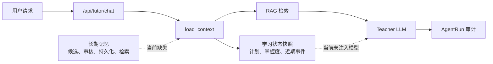

# Agent 记忆系统审计报告（2026-07-14）

## 1. 结论摘要

- **审计范围**：Agent 的学习状态加载、长期记忆、跨轮会话、模型上下文注入、审计与测试。
- **当前成熟度**：记忆子系统为 **L1 演示原型**；学习状态快照本身达到可用基础，但不构成完整 Agent 记忆。
- **一句话诊断**：系统已能按用户和学习目标保存结构化状态，但没有可持久化、可检索、可审计的长期记忆，也没有按线程恢复会话上下文。
- **当前最强能力**：`learning_state_snapshots` 以 `user_id + goal_id` 唯一约束保存学习计划、掌握度和部分当前状态，并由 `load_context` 统一读取。
- **当前主要瓶颈**：状态虽然被加载，却没有传入讲师模型；设计中的 `memories` 表和记忆写入门没有落地。



## 2. 审计范围与可信度

### 已检查

- 设计与分工文档：`adaptive_private_tutor_v1_architecture.md`、`docs/project_division/03_state_knowledge_base_and_database.md`、`docs/project_division/04_langgraph_and_agents.md`。
- 图编排与状态协议：`src/adaptive_tutor/phase2/schemas.py`、`src/adaptive_tutor/phase2/engine.py`。
- 应用与持久化层：`backend/app/application/engine.py`、`backend/app/application/tutor_service.py`、`backend/app/infrastructure/persistence/repositories/state_repository.py`、`backend/app/infrastructure/persistence/repositories/audit_repository.py`、`backend/app/models.py`。
- API、迁移和测试：`backend/app/routers/tutor.py`、`backend/alembic/versions/`、`tests/phase2/test_phase2_engine.py`、`tests/test_database_state.py`、`tests/test_stage3_api_workflow.py`。

### 已执行验证

| 命令 | 结果 | 说明 |
|---|---|---|
| `./scripts/test.ps1 -SkipCompile tests/phase2/test_phase2_engine.py tests/test_database_state.py tests/test_stage3_api_workflow.py tests/test_p0_auth_and_runtime.py` | 52 passed | 覆盖图编排、状态快照、API 主链路和运行时安全回归。 |
| `./scripts/test.ps1` | 187 passed, 1 warning | 同时完成 `compileall backend src tests -q`；警告来自 Starlette TestClient 的弃用提示。 |
| 全仓库符号与迁移扫描 | 未发现 `Memory` 模型、`memories` 表迁移、记忆仓储或 `save_memory` 路径 | 作为“长期记忆尚未落地”的静态证据。 |

### 未验证范围

- 没有真实 LLM 提供方下的上下文效果评估；当前结论基于调用参数和离线测试。
- 没有 PostgreSQL/pgvector 生产容器中的记忆迁移验证，因为现有实现尚无记忆迁移。
- 没有存量用户数据迁移需求；现有库没有 `memories` 表。

这些限制不影响“长期记忆与线程恢复尚未实现”的结论，但会影响未来对提示词质量与容量的评估。

## 3. 当前运行与架构地图

### 已实现的状态链路

```text
用户请求
  -> POST /api/tutor/chat
  -> answer_tutor_question
  -> Phase2TutorEngine.run
  -> load_context(user_id, goal_id)
  -> RAG retrieve(user message)
  -> teacher(prompt=user message, context=RAG chunks)
  -> AgentRun / ToolCall 审计
```

`LearningStateSnapshot` 以 `user_id + goal_id` 唯一约束存放活动计划、掌握度摘要、当前状态和生成来源。`SQLAlchemyStateRepository.load_context` 会从快照和事实表拼装任务、掌握度、近期学习事件与观察信号。

### 模块边界

| 模块 | 当前职责 | 已具备能力 | 关键缺口 |
|---|---|---|---|
| `LearningStateSnapshot` | 当前学习状态 | 用户与目标隔离、状态快照、计划与掌握度摘要 | 不是长期记忆；无记忆生命周期。 |
| `LearnerProfile` / `LearningGoal` | 偏好和学习目标 | 已持久化偏好、时间预算和目标 | 当前 `load_context` 未加载到 Agent 上下文。 |
| `Phase2TutorEngine` | 路由与 Agent 编排 | 统一加载状态、RAG、测验、观察和计划调整 | `memory_gate` 是空实现。 |
| `thread_id` | 运行关联标识 | 写入 `AgentRun` 审计 | 无 checkpoint、无消息历史、无恢复机制。 |
| `SQLAlchemyAuditSink` | 运行与工具审计 | 保存运行状态和工具摘要 | 未保存回答、上下文版本或记忆决策。 |

## 4. 主要问题

### [P1][已确认] 长期记忆只有状态字段占位，未形成任何可用闭环

- **类别**：显性缺陷 / 功能缺口。
- **证据**：设计要求 `memories` 表保存 `memory_type`、`content`、重要度、置信度、来源事件、过期时间和启用状态（`adaptive_private_tutor_v1_architecture.md:698-713`）。实际 `TutorState` 仅声明 `approved_memories`（`src/adaptive_tutor/phase2/schemas.py:30-54`），而 `memory_gate` 每次强制设为 `[]`（`src/adaptive_tutor/phase2/engine.py:281-284`）。
- **触发条件**：用户表达稳定偏好、完成重要里程碑、掌握度发生可确认变化，或在下一次聊天中需要调用既有记忆时。
- **影响**：Agent 无法保存或调用长期目标、稳定偏好和关键学习事件；“Agent 长期记忆”不能作为产品能力演示或验收。
- **根因**：设计文档中的数据契约、仓储接口、候选筛选、审批策略、持久化动作和读取策略没有进入实现。
- **最小修复方向**：先实现受控的结构化长期记忆，不自动保存全量对话。建立 `memories` 迁移、模型、仓储和幂等写入机制，再让 `memory_gate` 仅从可信结构化证据生成候选。
- **验证方式**：新增覆盖用户隔离、目标作用域、过期过滤、重复写入幂等、失效记忆不可读取、记忆来源可追溯的集成测试。

### [P1][已确认] 已加载的学习状态和偏好没有进入讲师模型

- **类别**：显性缺陷 / 个性化链路断裂。
- **证据**：`load_context` 将状态快照、任务、掌握度和近期事件写入图状态（`src/adaptive_tutor/phase2/engine.py:105-119`）。但 `teacher` 只以 `user_message` 作为 prompt、以 RAG chunks 作为 context 调用模型（`src/adaptive_tutor/phase2/engine.py:163-172`）。用户偏好已存在于 `LearnerProfile.learning_preferences`（`backend/app/models.py:36-45`），但状态仓储没有读取该模型。
- **触发条件**：用户选择“先讲原理再代码”等偏好，或当前计划、掌握度、待复习任务应改变讲师回答时。
- **影响**：模型无法稳定依照用户偏好、当前任务或掌握度生成个性化解释；数据库中的个性化数据停留在存储层。
- **根因**：上下文装配只连接了 RAG 文档，不包含可信的结构化用户上下文；状态与 RAG 的边界没有在 LLM 输入协议中体现。
- **最小修复方向**：创建受 token 上限约束的 `TutorContext`，包含目标摘要、当前任务、掌握度摘要、允许的稳定偏好和相关长期记忆；RAG 内容继续作为独立、非可信来源字段传入。
- **验证方式**：使用假 LLM 捕获输入，断言不同偏好和掌握度会产生不同结构化上下文；断言用户上传 RAG 文本不能覆盖系统或记忆字段。

### [P2][已确认] `thread_id` 只是审计标签，不是跨轮会话记忆

- **类别**：设计债务。
- **证据**：请求中的 `thread_id` 被放入图状态和 Agent 运行审计（`src/adaptive_tutor/phase2/engine.py:19-50`，`backend/app/infrastructure/persistence/repositories/audit_repository.py:18-36`）。图以 `graph.compile()` 创建并通过 `graph.invoke(state)` 执行（`src/adaptive_tutor/phase2/engine.py:33,64-103`），没有 checkpointer、线程消息表或恢复查询。
- **触发条件**：同一用户在同一线程追问“刚才的例子”“继续上一步练习”或需恢复未完成测验时。
- **影响**：线程 ID 看似存在，但不能恢复上下文；产品与实现对“会话”的语义不一致。
- **最小修复方向**：在长期记忆完成基础上，明确区分“短期线程状态”和“长期用户记忆”。V1 可先持久化有限轮数的结构化会话摘要，不应把整段原始聊天直接塞入提示词。
- **验证方式**：同一线程的第二次请求可读取受限摘要；不同用户或不同线程不能读取该摘要；清理/过期策略可验证。

### [P2][已确认] Agent 审计无法解释回答和记忆决策

- **类别**：工程风险 / 可观测性缺口。
- **证据**：`SQLAlchemyAuditSink.record_agent_run` 将 `output_snapshot` 固定写为 `{"status": payload["status"]}`（`backend/app/infrastructure/persistence/repositories/audit_repository.py:18-31`）。图运行的审计 payload 只包含线程、用户、目标、图版本、触发类型、状态和延迟（`src/adaptive_tutor/phase2/engine.py:35-49`）。
- **影响**：无法追溯一次回答使用了哪些结构化记忆、哪些被拒绝、上下文版本为何、是否使用了降级路径；后续调试“记错”或“没有记住”会缺少证据。
- **最小修复方向**：记录脱敏后的上下文摘要、选中的 memory IDs、候选接受/拒绝原因、RAG citation IDs、策略版本和回答哈希；避免保存不必要的原始敏感内容。
- **验证方式**：对一次写入记忆和一次读取记忆的运行，断言审计记录可关联相应 memory ID、策略版本与决策结果。

### [P2][已确认] 现有测试没有验证记忆边界

- **类别**：测试与可验证性缺口。
- **证据**：图编排测试覆盖 RAG、测验、计划调整和审计动作（`tests/phase2/test_phase2_engine.py`），状态测试覆盖每用户目标一份当前快照（`tests/test_database_state.py:7-65`）；但没有 `memory_gate`、`approved_memories`、长期记忆隔离、过期、去重或上下文注入的测试。
- **影响**：即使未来增加记忆实现，也容易在跨用户隔离、提示注入、过期和重复写入上产生回归。
- **最小修复方向**：在每个记忆读写边界增加单元/集成测试，并在 API 流程测试中覆盖“写入后跨请求读取”的最小闭环。

## 5. 设计成熟度与边界

| 维度 | 当前等级 | 证据 | 进入下一等级的最小条件 |
|---|---|---|---|
| 功能正确性 | L1 | 当前状态与 RAG 可运行；长期/线程记忆缺失 | 实现可验证的读写闭环。 |
| 架构边界 | L2 | 状态、RAG、图编排、审计已有模块边界 | 在输入协议中隔离事实、长期记忆和不可信文档。 |
| 测试 | L2（状态）/ L0（记忆） | 全量 187 测试通过；无记忆覆盖 | 记忆生命周期和隔离测试进入 CI。 |
| 安全 | L1 | 状态按用户和目标读取；RAG 标记非可信内容 | 长期记忆的所有权、来源可信度、写入策略和隐私设置落地。 |
| 可靠性 | L1 | 事实状态可持久化 | 记忆写入幂等、事务、过期和回滚可验证。 |
| 观测性 | L1 | AgentRun/ToolCall 存在 | 审计记忆选择和上下文版本。 |

### 当前设计的适用范围

当前结构适合演示“按学习状态调整计划”和“带 RAG 引用的单次讲解”。它不适合宣称拥有长期个性化记忆，或依赖多轮会话理解的学习助手。当多次对话、并发写入、隐私删除、记忆更新与过期成为真实需求时，当前设计会失效。

### 不应采用的方案

不建议立即实现“自动总结并保存所有聊天内容”。它会把临时表达、模型错误、RAG 中的提示注入文本和未经验证的信息固化为长期事实，且会扩大敏感数据保留范围。

## 6. 下一阶段开发计划

**阶段目标**：Agent 能以按用户隔离、可追溯、可过期的方式保存稳定学习信息，并在后续回答中使用受控上下文。

| 顺序 | 任务 | 结果与原因 | 依赖 | 验收标准 | 测试 | 工作量 |
|---|---|---|---|---|---|---|
| M1 | 建立长期记忆契约与迁移 | 增加 `memories` 模型、Alembic 迁移、仓储和输入 schema；字段至少含用户、可选目标作用域、类型、结构化内容、重要度、置信度、来源、过期、启用和幂等键 | 无 | 新库可迁移；只允许白名单类型；读取默认过滤失效/过期记录 | 迁移、所有权、目标作用域、过期、去重和事务测试 | M |
| M2 | 实现受控读取与讲师上下文 | 创建受 token 预算约束的 `TutorContext`，统一装配目标、当前任务、掌握度、偏好和相关长期记忆；将 RAG 作为独立非可信内容 | M1 | 假 LLM 可观测到结构化上下文；不同偏好和状态影响回答策略；RAG 不能覆盖记忆字段 | 上下文装配、提示注入边界、跨用户隔离和 API 流程测试 | M |
| M3 | 实现证据驱动写入门与审计 | `memory_gate` 只处理显式偏好更新、结构化学习证据和里程碑；写入候选、接受/拒绝原因与 memory ID 进入审计 | M1、M2 | 不保存全量聊天或原始 RAG；重复事件不重复创建；审计可解释一次读写决策 | 门控策略、幂等、审计关联、回滚与端到端闭环测试 | L |

### 暂不处理

- 不引入向量化长期记忆检索：当前结构化偏好、目标、掌握度和里程碑的数量有限，先使用可解释的条件过滤与排序。
- 不存储全量聊天记录：先明确数据保留、删除与隐私策略后再评估。
- 不拆分微服务：当前模块化单体足够承载记忆仓储和上下文装配。

## 7. 学习补齐计划

| 优先级 | 知识 | 对应仓库问题 | 最小实践 | 掌握证明 |
|---|---|---|---|---|
| 现在必须 | 事实、状态、短期会话与长期记忆的边界 | 当前把状态层误当作完整记忆 | 为每个字段标明来源、作用域、保留期、是否可进入模型 | 一页数据分类表与对应测试。 |
| 现在必须 | 多租户隔离与幂等写入 | 新增记忆后不能跨用户读取或重复持久化 | 为同用户重复事件、跨用户查询和过期记录编写集成测试 | 测试在 SQLite 与 PostgreSQL 上均通过。 |
| 边做边学 | 提示词上下文与提示注入边界 | 当前模型输入没有区分状态、记忆和 RAG | 实现 `TutorContext` 并为不可信 RAG 添加明确边界 | 假 LLM 测试能证明结构化字段不会被文档文本覆盖。 |
| 边做边学 | 审计与隐私最小化 | 现有 AgentRun 无法解释记忆决策 | 为记忆选择记录 ID、哈希和理由，不记录无必要原文 | 可通过一次运行审计还原决策链。 |

## 8. 本轮第一步

- **任务**：先为 M1 写失败测试，固定长期记忆的最小安全契约。
- **涉及文件**：新建 `tests/test_memory_repository.py`，随后才新增 `backend/app/models.py`、迁移和记忆仓储。
- **操作顺序**：先定义记录字段与作用域；写“同用户可读、跨用户不可读、过期不可读、重复事件幂等”四类测试；再实现最小模型和仓储使测试通过。
- **完成标准**：测试证明读写、隔离、过期与去重边界，而不依赖真实 LLM。
- **完成后再做什么**：只进行 M2，将经过筛选的结构化记忆注入讲师上下文。

## 9. 假设与待确认项

- **假设**：长期记忆的首批内容仅包括稳定学习偏好、长期目标、已确认的掌握度摘要和关键里程碑。
- **假设**：学习目标可作为记忆的可选作用域；用户级偏好应跨目标可用。
- **待确认**：用户是否需要查看、编辑或删除长期记忆；该答案会影响 API、前端和隐私审计范围。
- **待确认**：是否需要保留有限的短期对话摘要；该答案会影响 `thread_id` 的持久化设计，但不应阻塞 M1。
